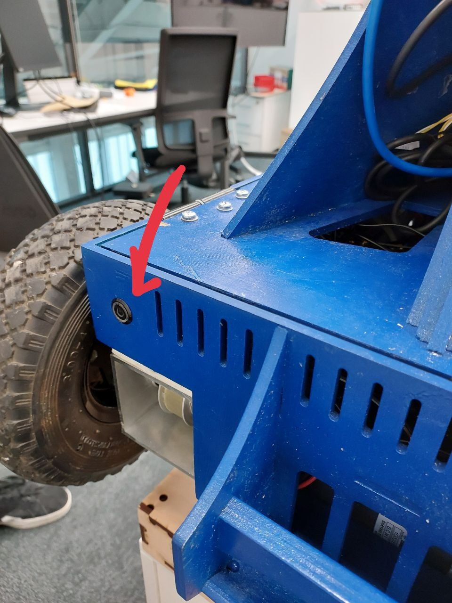
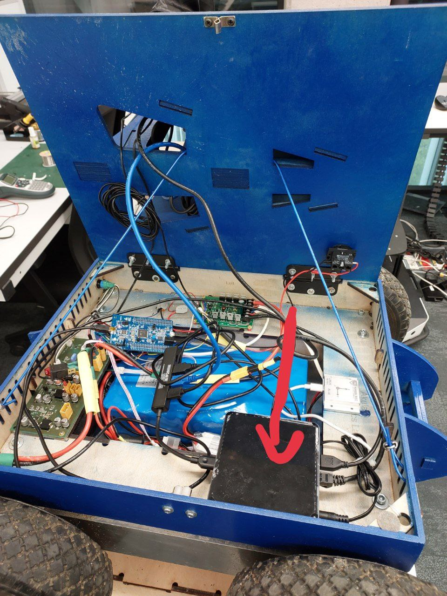
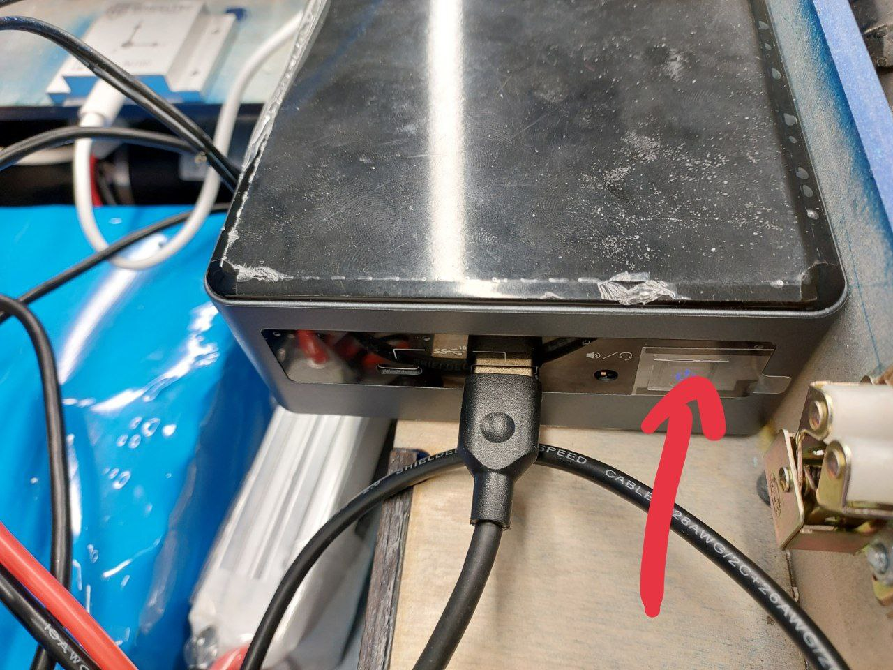
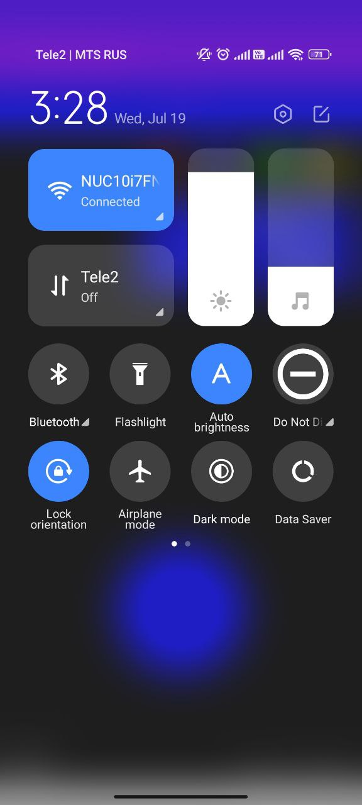
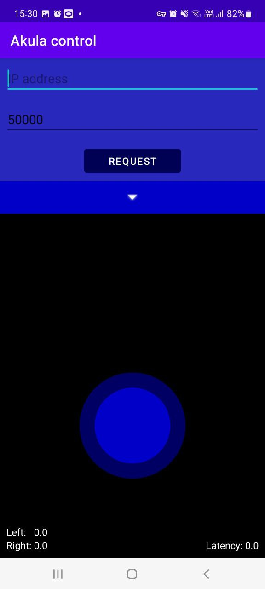
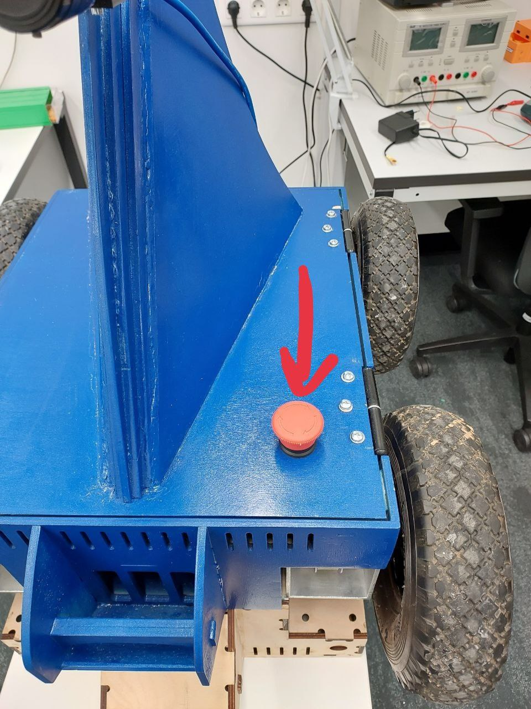
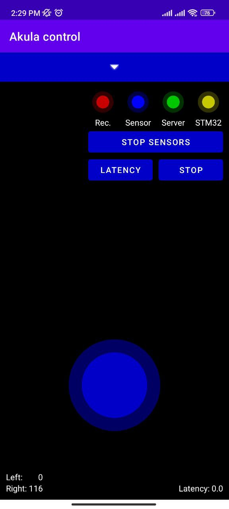

# Akula_Robot
All instructions to launch and run the Akula robot. 

(Please be aware the oreder of instructions in the steps does matter)

## Step 0
Before doing anything else, turn on the robot with the power button behind the robot:



Turn on the Intel NUC system. For that purpose open the head part of the robot to access the NUC hardware. 





Then NUC will initiate a network signal which you can find it in your wifi networks. Connect to it and the password is:  ``` mrob@148 ``` .


## Step 1

After connecting to the NUC network, connect to NUC's OS through ``` ssh ``` protocol: 

```
ssh mrob@10.42.0.1
```

The password is the same: ``` mrob@148 ```

After getting the remote access to the OS of NUC we can run the ROS2 packages to run the sensors and record data. 

## Step 2

The packages for recording data are already installed on the OS but in case of installing from scratch, you can follow this instruction and build the packages from zero: 

* Install ROS2 (tested on humble and foxy devisions)

### Install dependencies:
- pyserial: `pip3 install pyserial`
- nmea_msgs: `sudo apt-get install ros-humble-nmea-msgs`
- install pylon 5.1 from the [link](https://www.baslerweb.com/en/downloads/software-downloads/pylon-5-1-0-linux-x86-64-bit-debian/)

- ``` sudo apt install build-essential cmake libyaml-cpp-dev ```

Clone the repository recursively:

```
mkdir -p /ws/src
cd /ws/src
git clone --recursive https://github.com/HekmatTaherinejad95/Akula_Robot.git
cd ~/ws
colcon build
source /opt/ros/$ROS_DISTRO/setup.bash
source install/setup.bash
```

## Step 3

Turn on the robot control system. At the first step download the Anroid app for controling the robot from the [link](https://github.com/MobileRoboticsSkoltech/AkulaControl/releases/tag/v0.4.0)


Connect your mobile network to NUC hotspot wifi and also don't forget to turn of your simcard data roaming.



After installing the application please enter the ip 10.42.0.1 into request part and connect to controlling unit of the robot: 



After connect to control unit place robot in desired environment for recording and release the safety button and start riding the robot.



## Step 4
 In the next step these are the commands for launching the sensors and recording a rosbag for sensors data:

 ```
 ros2 launch akula_package Main.launch.py
 ```
For recording all the topics, open another terminal:

```
source /opt/ros/$ROS_DISTRO/setup.bash
ros2 bag record -a
```
Or alternatively you can use Android application interface to record data: 



The recorded bags are save in this directory:

```
/home/mrob/RosBags
```


